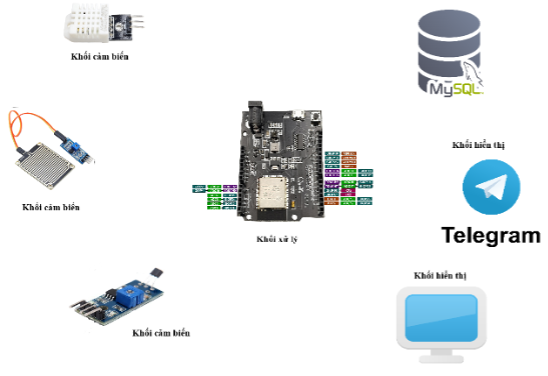
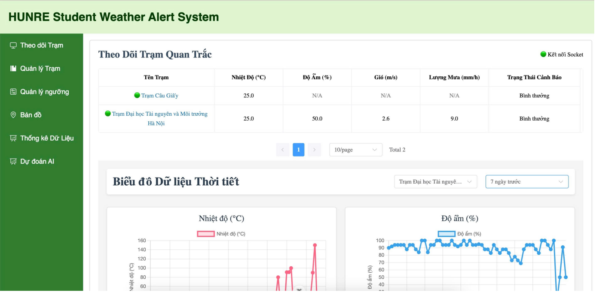
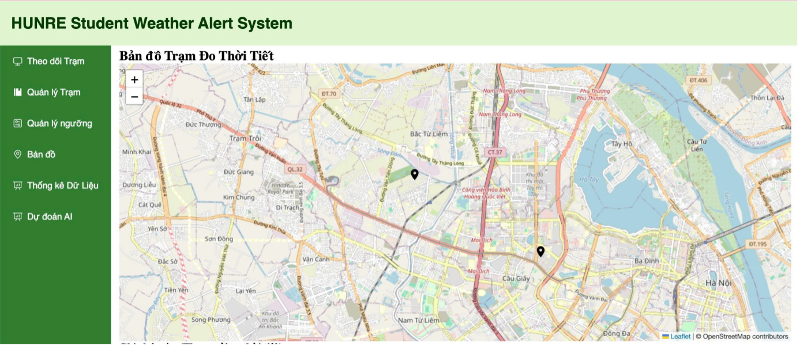
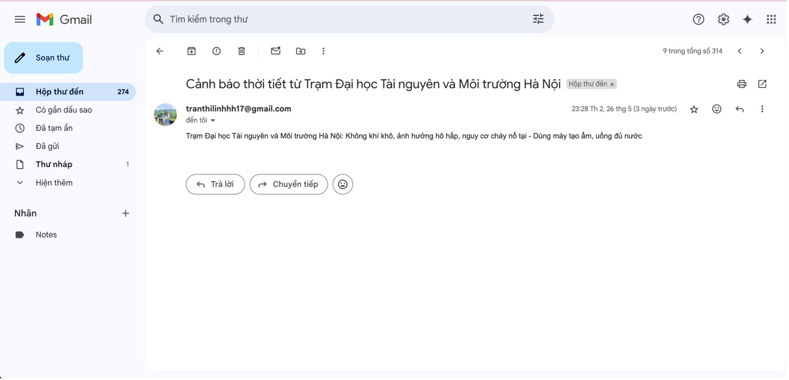
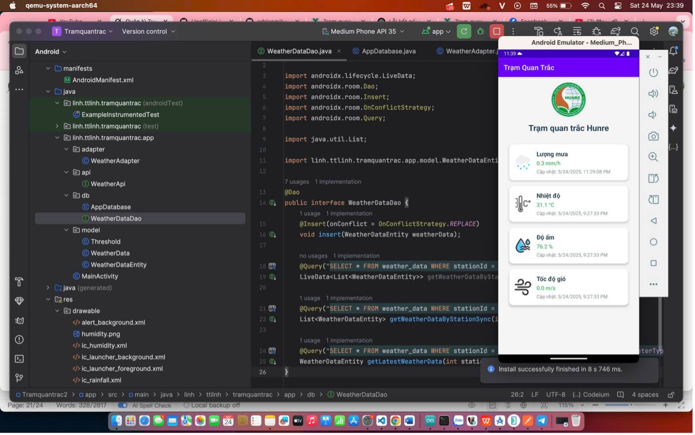

# 🌦️ Weather Monitoring Station – Hệ thống quan trắc thời tiết realtime

## 📖 Giới thiệu
Dự án **Hệ thống quan trắc thời tiết realtime** được phát triển trong khuôn khổ nghiên cứu khoa học sinh viên (2024 – 2025).  
Hệ thống giúp thu thập dữ liệu từ các trạm quan trắc (ESP32 + cảm biến), lưu trữ vào cơ sở dữ liệu MySQL và hiển thị realtime qua **web dashboard** và **mobile app Android**.  
Ngoài ra, hệ thống còn cung cấp tính năng **cảnh báo vượt ngưỡng (Threshold Alert)** gửi trực tiếp qua **Telegram, Discord và Email**.

---

## 👨‍👩‍👧‍👦 Thông tin nhóm
- Số lượng thành viên: **04**
- Vai trò của tôi: **Lead Software Developer (phụ trách toàn bộ phần mềm)**
- Github: [nckh_2024_2025_hunre_tramquantrac](https://github.com/linhtran17/nckh_2024_2025_hunre_tramquantrac)

---

## ⚡ Tính năng chính
- Thu thập dữ liệu từ cảm biến **nhiệt độ, độ ẩm, lượng mưa, tốc độ gió**.
- Đồng bộ dữ liệu realtime từ ESP32 về server qua **Socket.IO**.
- Hiển thị dashboard web: biểu đồ, trạng thái trạm, bản đồ các điểm quan trắc.
- Lọc dữ liệu theo ngày/tuần/tháng, **xuất file Excel**.
- Cảnh báo vượt ngưỡng (Threshold Alert) và gửi thông báo qua:
  - ✅ **Telegram Bot**
  - ✅ **Discord Webhook**
  - ✅ **Email Notification**
- Ứng dụng **Android (Java)** hiển thị dữ liệu và thông báo ngay trên điện thoại.

---

## 🖼️ Hình ảnh minh họa
### Use Case Diagram


### Kiến trúc phần cứng


### Mô hình thực tế


### Giao diện Web
  
  


### Mobile App (Android Java)


---

## 🛠️ Công nghệ sử dụng
### Backend
- **Node.js, Express**
- **Sequelize (MySQL)**
- **Socket.IO** (truyền dữ liệu realtime)
- **Nodemailer, Discord.js, Telegram Bot API**
- **ExcelJS** (xuất báo cáo)

### Frontend
- **Vue 3 (Composition API)**
- **Chart.js** (biểu đồ dữ liệu thời tiết)
- **Axios, Bootstrap**

### Mobile
- **Android (Java)**
- RecyclerView, Retrofit, Room Database

---

## 🚀 Cài đặt & Chạy thử

### 1. Clone repo
```bash
git clone https://github.com/linhtran17/nckh_2024_2025_hunre_tramquantrac.git
cd nckh_2024_2025_hunre_tramquantrac/realtime_app_api
```

### 2. Cài đặt dependencies
```bash
npm install
```

### 3. Tạo file `.env`
```env
PORT=3005
DB_HOST=localhost
DB_USER=root
DB_PASS=yourpassword
DB_NAME=weather_station
EMAIL_USER=your_email@gmail.com
EMAIL_PASS=your_app_password
EMAIL_RECIPIENT=receiver_email@gmail.com
TELEGRAM_TOKEN=your_bot_token
TELEGRAM_CHAT_ID=your_chat_id
DISCORD_WEBHOOK_URL=your_webhook_url
```

### 4. Chạy server
```bash
npm run dev
```

### 5. Truy cập
- Backend API: [http://localhost:3005](http://localhost:3005)
- Web Dashboard: [http://localhost:5173](http://localhost:5173)

---

## 📊 Cấu trúc thư mục
```
nckh_2024_2025_hunre_tramquantrac/
│── realtime_app_api/        # Backend API (Node.js, Express, Sequelize, Socket.IO)
│── realtime_app/            # Web Dashboard (Vue 3, Chart.js)
│── docs/screenshots/        # Tài liệu & ảnh minh họa
│── mobile_app/              # Android App (Java)
```

---

## 📌 Thành tựu
- Hoạt động ổn định trên nhiều trạm quan trắc.
- Tích hợp thành công cảnh báo realtime qua nhiều kênh (Telegram, Discord, Email).
- Xuất báo cáo và thống kê dữ liệu chi tiết.
- Ứng dụng Android giúp người dùng theo dõi thời tiết mọi lúc, mọi nơi.

---

## 👨‍💻 Người thực hiện
- **Trần Thị Linh** 
- Cùng các thành viên nhóm hỗ trợ phần cứng & triển khai thực tế.

---
